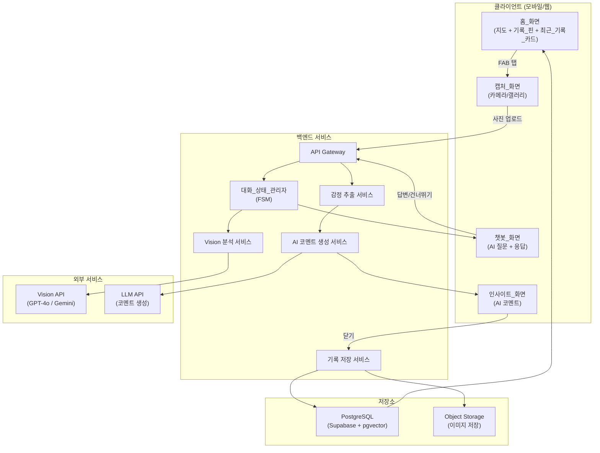
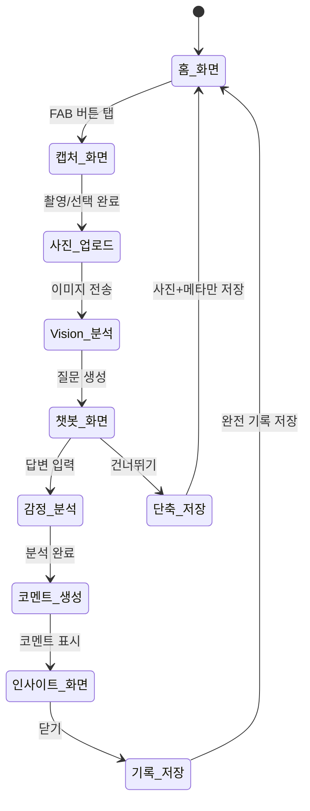
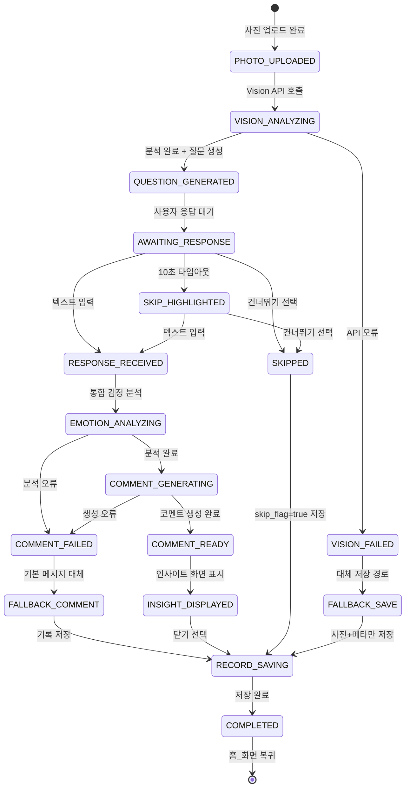
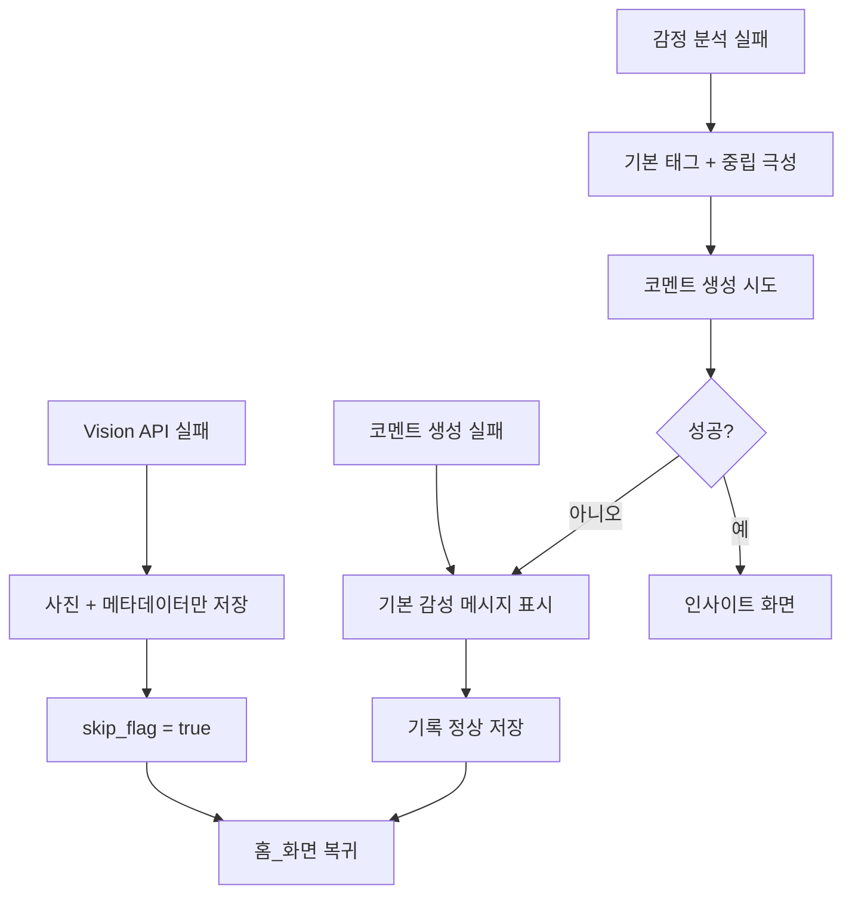

# 소확행 서비스 설계 문서

## 개요 (Overview)

소확행 서비스는 사용자가 일상의 작은 행복을 사진과 짧은 텍스트로 기록하고, AI가 감정을 분석하여 따뜻한 코멘트를 제공하는 지도 기반 아카이브 서비스이다.

핵심 설계 원칙:
- **초경량 UX**: 사진 촬영부터 AI 코멘트 확인까지 최대 4단계 이내 완료
- **AI 중심 감정 분석**: Vision API + NLP 기반 통합 분석으로 사용자 개입 최소화
- **지도 기반 시각화**: 피드형이 아닌 지도 중심 레이아웃으로 공간적 행복 아카이브 제공
- **상태 기반 대화 관리**: FSM(Finite State Machine) 기반 대화 흐름으로 끊김 없는 기록 경험

### 기술 스택

| 영역 | 기술 |
|------|------|
| 이미지 분석 | GPT-4o Vision / Gemini 1.5 Pro Vision |
| 대화 상태 관리 | LangGraph 또는 자체 FSM |
| 감정 추출 | NLP 기반 감정 polarity + 감정 태그 + 핵심 키워드 |
| 저장소 | PostgreSQL (Supabase) + pgvector |
| AI 코멘트 | 프롬프트 엔지니어링 기반 감성 텍스트 생성 |
| 지도 | Mapbox GL JS 또는 Google Maps SDK |

## 아키텍처 (Architecture)

### 시스템 아키텍처 다이어그램



### 사용자 플로우 다이어그램



### 대화 상태 머신 (FSM)



## 컴포넌트 및 인터페이스 (Components and Interfaces)

### 1. 클라이언트 컴포넌트

#### HomeMapView
- 지도 렌더링 및 기록_핀 표시
- 최근_기록_카드 가로 스와이프 영역
- FAB_버튼 렌더링
- 인터페이스:
  - `loadRecordPins(userId: string): RecordPin[]`
  - `loadRecentCards(userId: string, limit: number): RecentCard[]`
  - `onPinTap(recordId: string): void`
  - `onFabTap(): void`

#### CaptureView
- 카메라 촬영 / 갤러리 선택 UI
- EXIF 메타데이터 추출
- 인터페이스:
  - `capturePhoto(): PhotoResult`
  - `selectFromGallery(): PhotoResult`
  - `extractExif(photo: PhotoResult): ExifMetadata`

#### ChatbotView
- AI 질문 표시 및 사용자 응답 수집
- 건너뛰기 버튼 및 10초 타임아웃 강조
- 인터페이스:
  - `displayQuestion(question: string): void`
  - `onUserResponse(text: string): void`
  - `onSkip(): void`
  - `highlightSkipButton(): void`

#### InsightView
- AI 코멘트 표시 (말풍선/카드/팝업)
- 닫기 버튼
- 인터페이스:
  - `displayComment(comment: string): void`
  - `onClose(): void`

### 2. 백엔드 서비스

#### VisionAnalysisService
- Vision API 호출 및 결과 파싱
- 인터페이스:
```typescript
interface VisionAnalysisService {
  analyze(imageUrl: string): Promise<VisionResult>;
}

interface VisionResult {
  visionTags: string[];       // 객체, 색감, 분위기, 장소 맥락
  confidence: number;
  rawResponse: object;
}
```

#### EmotionExtractionService
- 사진 분석 + 텍스트 통합 감정 추출
- 인터페이스:
```typescript
interface EmotionExtractionService {
  extractWithText(visionResult: VisionResult, userText: string): Promise<EmotionResult>;
  extractFromVisionOnly(visionResult: VisionResult): Promise<EmotionResult>;
}

interface EmotionResult {
  emotionPolarity: 'positive' | 'neutral' | 'negative';
  emotionTags: string[];        // 편안함, 설렘, 뿌듯함 등
  contextKeywords: string[];    // 산책, 날씨, 커피 등
}
```

#### CommentGenerationService
- AI 감성 코멘트 생성
- 인터페이스:
```typescript
interface CommentGenerationService {
  generate(input: CommentInput): Promise<string>;
  getFallbackComment(emotionTags: string[]): string;
}

interface CommentInput {
  visionTags: string[];
  emotionTags: string[];
  contextKeywords: string[];
  userText: string | null;
  location: { latitude: number; longitude: number } | null;
  createdAt: Date;
  userPreferences: PreferenceVector | null;
}
```

#### ConversationStateManager (FSM)
- 대화 흐름 상태 전이 관리
- 인터페이스:
```typescript
type ConversationState =
  | 'PHOTO_UPLOADED'
  | 'VISION_ANALYZING'
  | 'VISION_FAILED'
  | 'QUESTION_GENERATED'
  | 'AWAITING_RESPONSE'
  | 'SKIP_HIGHLIGHTED'
  | 'RESPONSE_RECEIVED'
  | 'SKIPPED'
  | 'EMOTION_ANALYZING'
  | 'COMMENT_GENERATING'
  | 'COMMENT_READY'
  | 'COMMENT_FAILED'
  | 'FALLBACK_COMMENT'
  | 'FALLBACK_SAVE'
  | 'INSIGHT_DISPLAYED'
  | 'RECORD_SAVING'
  | 'COMPLETED';

type ConversationEvent =
  | { type: 'PHOTO_UPLOAD_COMPLETE'; imageUrl: string; exif: ExifMetadata }
  | { type: 'VISION_ANALYSIS_COMPLETE'; result: VisionResult }
  | { type: 'VISION_ANALYSIS_FAILED'; error: Error }
  | { type: 'USER_RESPONSE'; text: string }
  | { type: 'USER_SKIP' }
  | { type: 'TIMEOUT_10S' }
  | { type: 'EMOTION_ANALYSIS_COMPLETE'; result: EmotionResult }
  | { type: 'COMMENT_GENERATED'; comment: string }
  | { type: 'COMMENT_GENERATION_FAILED'; error: Error }
  | { type: 'INSIGHT_CLOSED' }
  | { type: 'RECORD_SAVED' };

interface ConversationStateManager {
  getCurrentState(): ConversationState;
  transition(event: ConversationEvent): ConversationState;
  getContext(): ConversationContext;
}

interface ConversationContext {
  imageUrl: string | null;
  exifMetadata: ExifMetadata | null;
  visionResult: VisionResult | null;
  userText: string | null;
  emotionResult: EmotionResult | null;
  aiComment: string | null;
  skipFlag: boolean;
}
```

#### RecordStorageService
- 소확행 기록 CRUD 및 누적 분석
- 인터페이스:
```typescript
interface RecordStorageService {
  save(record: SohwakhaengRecord): Promise<string>;
  getById(recordId: string): Promise<SohwakhaengRecord>;
  getByUser(userId: string, options?: QueryOptions): Promise<SohwakhaengRecord[]>;
  getRecentByUser(userId: string, limit: number): Promise<SohwakhaengRecord[]>;
  getRecordPins(userId: string, bounds: MapBounds): Promise<RecordPin[]>;
}
```

#### EmotionDataSerializer
- 감정 분석 결과 직렬화/역직렬화
- 인터페이스:
```typescript
interface EmotionAnalysisData {
  emotionTags: string[];
  emotionPolarity: 'positive' | 'neutral' | 'negative';
  contextKeywords: string[];
  visionTags: string[];
}

interface EmotionDataSerializer {
  serialize(data: EmotionAnalysisData): string;
  deserialize(json: string): EmotionAnalysisData;
}
```


## 데이터 모델 (Data Models)

### 소확행 기록 (SohwakhaengRecord)

```sql
CREATE TABLE sohwakhaeng_records (
    id              UUID PRIMARY KEY DEFAULT gen_random_uuid(),
    user_id         UUID NOT NULL REFERENCES users(id),
    image_url       TEXT NOT NULL,
    created_at      TIMESTAMPTZ NOT NULL DEFAULT NOW(),
    latitude        DOUBLE PRECISION,
    longitude       DOUBLE PRECISION,
    raw_user_text   TEXT,
    vision_tags     JSONB DEFAULT '[]',
    emotion_tags    JSONB DEFAULT '[]',
    context_keywords JSONB DEFAULT '[]',
    ai_comment      TEXT,
    skip_flag       BOOLEAN NOT NULL DEFAULT FALSE,
    emotion_polarity VARCHAR(10) CHECK (emotion_polarity IN ('positive', 'neutral', 'negative')),
    updated_at      TIMESTAMPTZ NOT NULL DEFAULT NOW()
);

CREATE INDEX idx_records_user_id ON sohwakhaeng_records(user_id);
CREATE INDEX idx_records_created_at ON sohwakhaeng_records(created_at DESC);
CREATE INDEX idx_records_location ON sohwakhaeng_records USING GIST (
    ST_MakePoint(longitude, latitude)
);
```

### 사용자 취향 벡터 (UserPreference)

```sql
CREATE TABLE user_preferences (
    user_id             UUID PRIMARY KEY REFERENCES users(id),
    preference_vector   vector(256),
    top_emotion_tags    JSONB DEFAULT '[]',
    top_context_keywords JSONB DEFAULT '[]',
    preferred_time_slots JSONB DEFAULT '[]',
    preferred_place_types JSONB DEFAULT '[]',
    emotion_frequency   JSONB DEFAULT '{}',
    total_records       INTEGER DEFAULT 0,
    updated_at          TIMESTAMPTZ NOT NULL DEFAULT NOW()
);
```

### TypeScript 데이터 타입

```typescript
interface SohwakhaengRecord {
  id: string;
  userId: string;
  imageUrl: string;
  createdAt: Date;
  latitude: number | null;
  longitude: number | null;
  rawUserText: string | null;
  visionTags: string[];
  emotionTags: string[];
  contextKeywords: string[];
  aiComment: string | null;
  skipFlag: boolean;
  emotionPolarity: 'positive' | 'neutral' | 'negative' | null;
}

interface ExifMetadata {
  dateTaken: Date | null;
  latitude: number | null;
  longitude: number | null;
}

interface RecordPin {
  id: string;
  latitude: number;
  longitude: number;
  thumbnailUrl: string;
  emotionKeyword: string;
  shortText: string;
}

interface RecentCard {
  id: string;
  imageUrl: string;
  emotionKeyword: string;
  shortText: string;
  createdAt: Date;
}

interface PreferenceVector {
  vector: number[];
  topEmotionTags: string[];
  topContextKeywords: string[];
  preferredTimeSlots: string[];
  preferredPlaceTypes: string[];
  emotionFrequency: Record<string, number>;
  totalRecords: number;
}

interface EmotionAnalysisData {
  emotionTags: string[];
  emotionPolarity: 'positive' | 'neutral' | 'negative';
  contextKeywords: string[];
  visionTags: string[];
}

interface MapBounds {
  northEast: { latitude: number; longitude: number };
  southWest: { latitude: number; longitude: number };
}
```


## 정확성 속성 (Correctness Properties)

*속성(Property)이란 시스템의 모든 유효한 실행에서 참이어야 하는 특성 또는 동작을 의미한다. 속성은 사람이 읽을 수 있는 명세와 기계가 검증할 수 있는 정확성 보장 사이의 다리 역할을 한다.*

### Property 1: 기록→뷰모델 변환 시 필수 필드 포함

*For any* 유효한 SohwakhaengRecord에 대해, RecordPin으로 변환하면 thumbnailUrl, emotionKeyword, shortText가 항상 비어있지 않은 값으로 포함되어야 하며, RecentCard로 변환하면 imageUrl, emotionKeyword, shortText가 항상 비어있지 않은 값으로 포함되어야 한다.

**Validates: Requirements 1.1, 1.2, 1.5**

### Property 2: 최근 기록 카드 개수 제한

*For any* 사용자와 임의의 기록 수(0개 이상)에 대해, getRecentByUser 함수에 limit=4를 전달하면 반환되는 카드 수는 항상 min(전체 기록 수, 4) 이하여야 한다.

**Validates: Requirements 1.4**

### Property 3: EXIF 메타데이터 추출

*For any* EXIF 메타데이터가 포함된 사진에 대해, extractExif 함수는 dateTaken, latitude, longitude 필드를 포함하는 ExifMetadata 객체를 반환해야 하며, EXIF가 없는 사진에 대해서는 각 필드가 null인 객체를 반환해야 한다.

**Validates: Requirements 2.5**

### Property 4: FSM 유효 상태 전이

*For any* 유효한 ConversationState와 ConversationEvent 조합에 대해, transition 함수는 정의된 상태 전이 규칙에 따라 올바른 다음 상태를 반환해야 하며, 유효하지 않은 이벤트에 대해서는 현재 상태를 유지하거나 오류를 발생시켜야 한다. 특히:
- PHOTO_UPLOADED + VISION_ANALYSIS_COMPLETE → QUESTION_GENERATED
- AWAITING_RESPONSE + USER_RESPONSE → RESPONSE_RECEIVED
- AWAITING_RESPONSE + USER_SKIP → SKIPPED
- AWAITING_RESPONSE + TIMEOUT_10S → SKIP_HIGHLIGHTED
- INSIGHT_DISPLAYED + INSIGHT_CLOSED → RECORD_SAVING

**Validates: Requirements 2.2, 2.3, 3.3, 3.5, 5.5, 7.1, 7.2**

### Property 5: 건너뛰기 경로 데이터 무결성

*For any* 대화 세션에서 사용자가 건너뛰기를 선택하면, 저장되는 SohwakhaengRecord는 skip_flag가 true이고, raw_user_text가 null이며, image_url과 위치 정보(latitude, longitude)는 원본 값을 유지해야 한다.

**Validates: Requirements 3.4, 7.3, 8.2**

### Property 6: 감정 분석 결과 구조 무결성

*For any* VisionResult(와 선택적 userText)에 대해, EmotionExtractionService의 분석 결과는 항상 유효한 emotionPolarity('positive', 'neutral', 'negative' 중 하나), 비어있지 않은 emotionTags 배열, 비어있지 않은 contextKeywords 배열을 포함해야 한다. 이는 텍스트 유무와 관계없이 동일하게 적용된다.

**Validates: Requirements 4.1, 4.2, 4.3**

### Property 7: 취향 벡터 갱신 단조성

*For any* 사용자의 기존 PreferenceVector와 새로운 EmotionResult에 대해, 취향 벡터 갱신 후 totalRecords는 정확히 1 증가해야 하며, 새로운 emotionTags와 contextKeywords가 누적 데이터에 반영되어야 한다.

**Validates: Requirements 4.4**

### Property 8: 오류 시 데이터 보존 및 복구

*For any* ConversationContext에 데이터가 수집된 상태에서 오류가 발생하면, 오류 처리 후에도 기존에 수집된 imageUrl, exifMetadata 등의 컨텍스트 데이터는 보존되어야 한다. 또한 getFallbackComment 함수는 임의의 emotionTags에 대해 항상 비어있지 않은 문자열을 반환해야 한다.

**Validates: Requirements 4.5, 5.6, 7.4**

### Property 9: 기록 저장-조회 라운드트립

*For any* 유효한 SohwakhaengRecord에 대해, save 후 getById로 조회하면 image_url, created_at, latitude, longitude, raw_user_text, vision_tags, emotion_tags, context_keywords, ai_comment, skip_flag, user_id가 원본과 동일해야 한다. 또한 저장 직후 getRecordPins 호출 시 해당 기록의 핀이 결과에 포함되어야 한다.

**Validates: Requirements 6.1, 6.2, 6.3**

### Property 10: 누적 분석 데이터 갱신

*For any* 사용자의 기록 목록에 대해, 누적 분석 데이터(행복 트리거 키워드, 선호 장소 유형, 선호 시간대, 감정 빈도 분포)는 해당 사용자의 전체 기록을 반영해야 하며, 새 기록 추가 시 누적 데이터가 일관되게 갱신되어야 한다.

**Validates: Requirements 6.4**

### Property 11: 감정 분석 데이터 직렬화 라운드트립

*For any* 유효한 EmotionAnalysisData 객체(emotionTags, emotionPolarity, contextKeywords, visionTags 포함)에 대해, serialize 후 deserialize하면 원본 객체와 동일한 결과를 생성해야 한다.

**Validates: Requirements 9.1, 9.2, 9.3**

### Property 12: 잘못된 JSON 입력 시 오류 반환

*For any* 유효하지 않은 JSON 문자열(구문 오류, 필수 필드 누락, 잘못된 타입 등)에 대해, deserialize 함수는 구체적인 파싱 오류 메시지를 포함하는 에러를 발생시켜야 한다.

**Validates: Requirements 9.4**


## 오류 처리 (Error Handling)

### 오류 유형 및 처리 전략

| 오류 유형 | 발생 지점 | 처리 전략 |
|-----------|-----------|-----------|
| Vision API 호출 실패 | VisionAnalysisService | FSM → VISION_FAILED → FALLBACK_SAVE. 사진+메타데이터만 저장, 사용자에게 분석 실패 안내 |
| AI 코멘트 생성 실패 | CommentGenerationService | FSM → COMMENT_FAILED → FALLBACK_COMMENT. 기본 감성 메시지로 대체, 기록은 정상 저장 |
| EXIF 추출 실패 | CaptureView | latitude/longitude/dateTaken을 null로 설정, 현재 시간과 기기 위치를 대체값으로 사용 |
| 이미지 업로드 실패 | ObjectStorage | 재시도 3회 후 실패 시 사용자에게 네트워크 오류 안내, 로컬 임시 저장 |
| DB 저장 실패 | RecordStorageService | 재시도 후 실패 시 로컬 큐에 저장, 네트워크 복구 시 동기화 |
| 감정 분석 실패 | EmotionExtractionService | 기본 감정 태그('기록됨')와 중립 극성으로 대체 |
| JSON 역직렬화 실패 | EmotionDataSerializer | 구체적인 파싱 오류 메시지 반환 (필드명, 기대 타입, 실제 값 포함) |
| 대화 흐름 중 예기치 않은 오류 | ConversationStateManager | 현재 컨텍스트 데이터 임시 저장, 오류 안내 후 홈_화면 복귀 옵션 제공 |

### 대체 경로 (Fallback Paths)



### 오류 메시지 가이드라인

- 기술적 용어 대신 사용자 친화적 표현 사용
- 예: "분석에 시간이 좀 더 필요해요. 사진은 안전하게 저장했어요."
- 예: "지금은 코멘트를 준비하지 못했어요. 대신 따뜻한 한마디를 남겨둘게요."
- 항상 사용자 데이터 보존을 최우선으로 처리

## 테스트 전략 (Testing Strategy)

### 이중 테스트 접근법

소확행 서비스는 단위 테스트와 속성 기반 테스트(Property-Based Testing)를 병행하여 포괄적인 정확성을 보장한다.

### 속성 기반 테스트 (Property-Based Testing)

**라이브러리**: [fast-check](https://github.com/dubzzz/fast-check) (TypeScript/JavaScript)

**설정**:
- 각 속성 테스트는 최소 100회 반복 실행
- 각 테스트에 설계 문서의 속성 번호를 태그로 포함
- 태그 형식: `Feature: sohwakhaeng-service, Property {number}: {property_text}`

**속성 테스트 목록**:

| 속성 | 테스트 대상 | 생성기 |
|------|------------|--------|
| P1 | 기록→뷰모델 변환 | 임의의 SohwakhaengRecord 생성 |
| P2 | 최근 기록 카드 제한 | 임의의 기록 목록 (0~100개) + limit 값 |
| P3 | EXIF 추출 | EXIF 유무가 랜덤인 사진 메타데이터 |
| P4 | FSM 상태 전이 | 임의의 (상태, 이벤트) 쌍 |
| P5 | 건너뛰기 경로 | 임의의 ConversationContext + SKIP 이벤트 |
| P6 | 감정 분석 구조 | 임의의 VisionResult + 선택적 텍스트 |
| P7 | 취향 벡터 갱신 | 임의의 PreferenceVector + EmotionResult |
| P8 | 오류 시 데이터 보존 | 임의의 ConversationContext + 오류 이벤트 |
| P9 | 기록 저장-조회 | 임의의 SohwakhaengRecord |
| P10 | 누적 분석 갱신 | 임의의 기록 시퀀스 |
| P11 | 직렬화 라운드트립 | 임의의 EmotionAnalysisData |
| P12 | 잘못된 JSON 오류 | 임의의 잘못된 JSON 문자열 |

### 단위 테스트 (Unit Testing)

단위 테스트는 구체적인 예시, 엣지 케이스, 통합 지점에 집중한다.

**주요 단위 테스트 영역**:

- **FSM 엣지 케이스**: 유효하지 않은 상태 전이 시도, 초기 상태 검증
- **EXIF 엣지 케이스**: EXIF 없는 사진, 부분적 EXIF(GPS만 있고 날짜 없음 등)
- **직렬화 엣지 케이스**: 빈 배열, 특수 문자 포함 태그, 매우 긴 문자열
- **건너뛰기 플로우**: 건너뛰기 시 정확한 필드 설정 확인
- **대체 코멘트**: 빈 emotionTags로 getFallbackComment 호출
- **최소 플로우 검증**: 홈→촬영→건너뛰기→홈이 4단계 이내인지 확인 (요구사항 8.1)
- **캡처 화면 편집 단계 부재**: PHOTO_UPLOADED 다음에 편집 상태가 없음 확인 (요구사항 2.4)

### 테스트 구조

```
tests/
├── properties/
│   ├── record-viewmodel.property.test.ts    # P1
│   ├── recent-cards-limit.property.test.ts  # P2
│   ├── exif-extraction.property.test.ts     # P3
│   ├── fsm-transitions.property.test.ts     # P4
│   ├── skip-path.property.test.ts           # P5
│   ├── emotion-analysis.property.test.ts    # P6
│   ├── preference-update.property.test.ts   # P7
│   ├── error-recovery.property.test.ts      # P8
│   ├── record-roundtrip.property.test.ts    # P9
│   ├── cumulative-analysis.property.test.ts # P10
│   ├── serialization.property.test.ts       # P11
│   └── invalid-json.property.test.ts        # P12
├── unit/
│   ├── fsm.test.ts
│   ├── exif.test.ts
│   ├── serializer.test.ts
│   ├── fallback-comment.test.ts
│   └── flow-steps.test.ts
└── generators/
    ├── record.generator.ts
    ├── emotion.generator.ts
    ├── vision.generator.ts
    └── conversation.generator.ts
```
